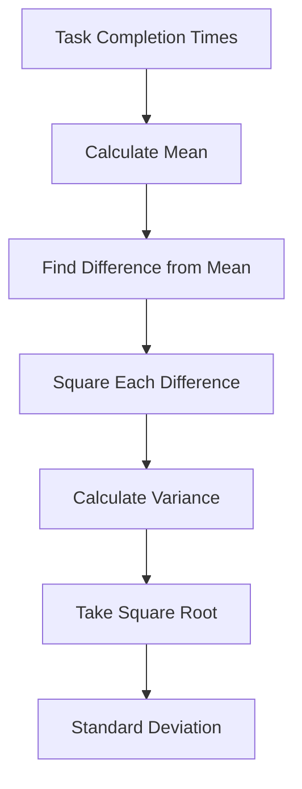
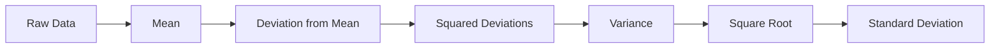
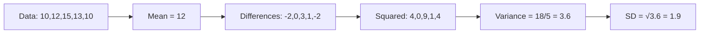

# Mean, Variance, and Standard Deviation

This document explains three important statistical measures used to analyze **task completion times**.

## Example Dataset

Suppose the task completion times (in minutes) are:

```text
10, 12, 15, 13, 10
```

---

# 1. Mean (Average)

The **mean** is the average time taken to complete a task.

## Formula

```text
Mean = (Sum of all values) / (Number of values)
```

## Calculation

```text
Mean = (10 + 12 + 15 + 13 + 10) / 5
     = 60 / 5
     = 12 minutes
```

### Interpretation

On average, the task takes **12 minutes** to complete.

---

# 2. Variance

Variance measures how much the completion times differ from the average.

## Formula (Population Variance)

```text
Variance = Σ(x - Mean)² / N
```

Where

- x = each observation
- Mean = average
- N = total observations

## Step 1: Find Differences

| Time | Mean | Difference | Squared Difference |
|------|------|------------|--------------------|
| 10 | 12 | -2 | 4 |
| 12 | 12 | 0 | 0 |
| 15 | 12 | 3 | 9 |
| 13 | 12 | 1 | 1 |
| 10 | 12 | -2 | 4 |

Sum of squared differences

```text
4 + 0 + 9 + 1 + 4 = 18
```

Variance

```text
Variance = 18 / 5
         = 3.6
```

### Interpretation

The completion times vary by **3.6 minutes²** around the average.

---

# 3. Standard Deviation (SD)

Standard deviation is the square root of the variance.

## Formula

```text
SD = √Variance
```

## Calculation

```text
SD = √3.6
   ≈ 1.90 minutes
```

### Interpretation

Task completion times are typically about **1.9 minutes** away from the average.

---

# Summary

| Measure | Formula | Unit | Meaning |
|----------|---------|------|---------|
| Mean | Σx / N | Minutes | Average completion time |
| Variance | Σ(x-Mean)² / N | Minutes² | Spread of completion times |
| Standard Deviation | √Variance | Minutes | Typical distance from the mean |

---

# Example Comparison

## Employee A

```text
11, 12, 12, 13, 12
```

Mean

```text
12 minutes
```

Standard Deviation

```text
Low
```

Employee A is very consistent.

---

## Employee B

```text
5, 12, 18, 10, 15
```

Mean

```text
12 minutes
```

Standard Deviation

```text
High
```

Employee B has the same average but much more variation.

---

# Key Takeaways

- **Mean** tells you the average task completion time.
- **Variance** measures how spread out the times are.
- **Standard Deviation** tells you the typical distance from the average.
- A **smaller SD** means more consistent performance.
- A **larger SD** means greater variability in completion times.
